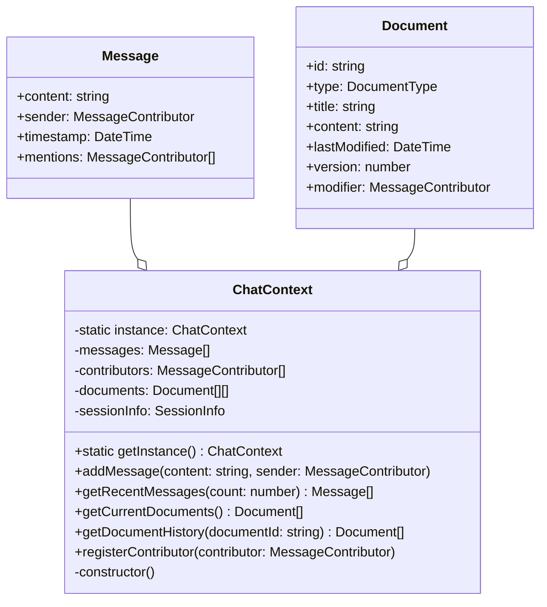
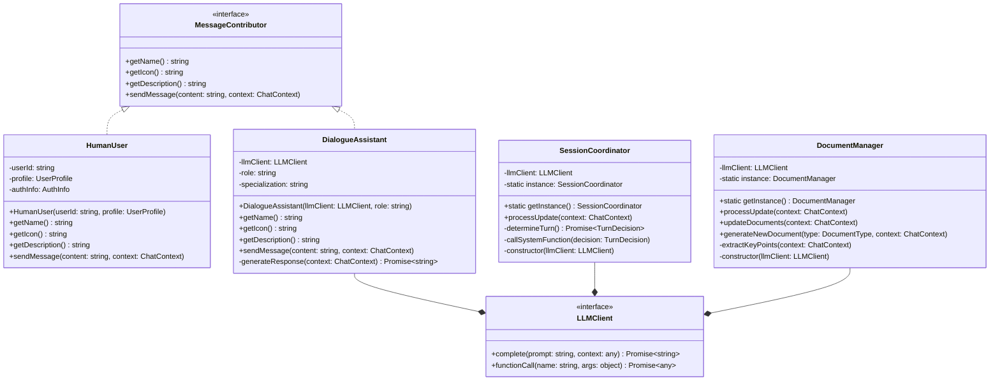

# CADDY (Collaborative AI Dialogue Dynamic System)設計書

目次
- [CADDY (Collaborative AI Dialogue Dynamic System)設計書](#caddy-collaborative-ai-dialogue-dynamic-system設計書)
  - [1. システムアーキテクチャ](#1-システムアーキテクチャ)
    - [1.1 全体構成](#11-全体構成)
      - [アーキテクチャ概要](#アーキテクチャ概要)
      - [コンポーネント構成](#コンポーネント構成)
    - [1.2 インターフェース設計](#12-インターフェース設計)
      - [認証・ユーザー管理系インターフェース](#認証ユーザー管理系インターフェース)
      - [チャット・メッセージング系インターフェース](#チャットメッセージング系インターフェース)
      - [ドキュメント管理系インターフェース](#ドキュメント管理系インターフェース)
      - [AIエージェント系インターフェース](#aiエージェント系インターフェース)
      - [セッション管理系インターフェース](#セッション管理系インターフェース)
      - [リポジトリ系インターフェース](#リポジトリ系インターフェース)
      - [インターフェースの特徴](#インターフェースの特徴)
    - [1.3 実装クラス設計](#13-実装クラス設計)
    - [1.4 クラス設計](#14-クラス設計)
      - [ChatContext](#chatcontext)
      - [MessageContributor](#messagecontributor)
  - [2. 詳細設計](#2-詳細設計)
    - [2.1 認証・認可フロー](#21-認証認可フロー)
      - [開発環境](#開発環境)
      - [本番環境](#本番環境)
    - [2.2 依存性注入設計](#22-依存性注入設計)
    - [2.1 中核クラス](#21-中核クラス)
      - [ChatContext](#chatcontext-1)
      - [MessageContributor](#messagecontributor-1)
      - [Document管理](#document管理)
    - [2.2 制御クラス](#22-制御クラス)
      - [SessionCoordinator](#sessioncoordinator)
      - [DocumentManager](#documentmanager)
  - [3. インターフェース設計](#3-インターフェース設計)
    - [3.1 外部インターフェース](#31-外部インターフェース)
      - [LLMクライアント](#llmクライアント)
      - [データベース](#データベース)
      - [Entra ID連携](#entra-id連携)
    - [3.2 内部インターフェース](#32-内部インターフェース)
      - [メッセージング](#メッセージング)
  - [4. デプロイメント設計](#4-デプロイメント設計)
    - [4.1 環境設定](#41-環境設定)
      - [開発環境](#開発環境-1)
      - [本番環境](#本番環境-1)
    - [4.2 設定パラメータ](#42-設定パラメータ)
  - [5. データ設計](#5-データ設計)
    - [5.1 データモデル](#51-データモデル)
      - [エンティティ](#エンティティ)
      - [リレーション](#リレーション)
    - [5.2 永続化設計](#52-永続化設計)
      - [データベース](#データベース-1)
      - [キャッシュ](#キャッシュ)
  - [6. テスト戦略](#6-テスト戦略)
    - [6.1 単体テスト](#61-単体テスト)
    - [6.2 統合テスト](#62-統合テスト)
  - [7. 処理フロー設計](#7-処理フロー設計)
    - [7.1 メッセージ処理フロー](#71-メッセージ処理フロー)
      - [基本フロー](#基本フロー)
      - [エラー処理](#エラー処理)
    - [7.2 ドキュメント処理フロー](#72-ドキュメント処理フロー)
      - [更新フロー](#更新フロー)
      - [同期処理](#同期処理)

## 1. システムアーキテクチャ

### 1.1 全体構成
#### アーキテクチャ概要
- インターフェースベースの依存性注入パターン採用
- 環境に応じた実装の切り替えが可能な設計
- マイクロサービス的な役割分担
- Azure Servicesとの統合を考慮した設計

#### コンポーネント構成
- フロントエンド（Next.js）
- バックエンド（NestJS）
  - インターフェース層
  - 実装層
  - プロバイダー層
- 外部サービス連携
  - Microsoft Entra ID
  - LLMサービス

### 1.2 インターフェース設計

#### 認証・ユーザー管理系インターフェース

```typescript
interface IAuthService {
 // 現在のユーザー情報を取得
 getCurrentUser(request: any): Promise<IAuthUser>;
 // アクセス権限を検証
 validateAccess(user: IAuthUser, requiredRoles?: string[]): boolean;
 // ユーザーのロールを取得
 getUserRoles(user: IAuthUser): Promise<string[]>;
 // セッショントークンの検証
 validateToken(token: string): Promise<boolean>;
}

interface IUserService {
 // ユーザー情報の取得
 findById(id: string): Promise<IUser>;
 findByEmail(email: string): Promise<IUser>;
 // ユーザー設定の管理
 getUserPreferences(userId: string): Promise<UserPreferences>;
 updateUserPreferences(userId: string, preferences: UserPreferences): Promise<void>;
 // ユーザーセッション管理
 getUserSessions(userId: string): Promise<Session[]>;
 invalidateSession(sessionId: string): Promise<void>;
}
```

#### チャット・メッセージング系インターフェース

```typescript
interface IChatService {
 // メッセージ送受信
 sendMessage(content: string, sender: IUser): Promise<IMessage>;
 getMessages(options: GetMessagesDto): Promise<IMessage[]>;
 getMentions(user: IUser): Promise<IMessage[]>;
 // メッセージ管理
 updateMessage(id: string, content: string): Promise<IMessage>;
 deleteMessage(id: string): Promise<void>;
 // チャットコンテキスト管理
 getContext(chatId: string): Promise<IChatContext>;
 updateContext(chatId: string, context: Partial<IChatContext>): Promise<void>;
}

interface IMessageContributor {
 // 送信者情報
 getId(): string;
 getName(): string;
 getType(): ContributorType;
 // メッセージ管理
 canSendMessage(): boolean;
 formatMessage(content: string): IMessage;
 // 権限管理
 hasPermission(permission: Permission): boolean;
}
```

#### ドキュメント管理系インターフェース

```typescript
interface IDocumentService {
 // ドキュメント基本操作
 createDocument(data: CreateDocumentDto): Promise<IDocument>;
 getDocument(id: string): Promise<IDocument>;
 updateDocument(id: string, data: UpdateDocumentDto): Promise<IDocument>;
 deleteDocument(id: string): Promise<void>;
 // バージョン管理
 getVersionHistory(id: string): Promise<IDocumentVersion[]>;
 revertToVersion(id: string, versionId: string): Promise<IDocument>;
 // メタデータ管理
 updateMetadata(id: string, metadata: DocumentMetadata): Promise<void>;
 getTags(id: string): Promise<string[]>;
}

interface IDocumentManager {
 // 自動ドキュメント生成
 generateDocument(context: IChatContext): Promise<IDocument>;
 updateFromChat(documentId: string, context: IChatContext): Promise<IDocument>;
 extractKeyPoints(messages: IMessage[]): Promise<string[]>;
 // 構造化処理
 organizeContent(document: IDocument): Promise<IDocument>;
 generateSummary(document: IDocument): Promise<string>;
}
```

#### AIエージェント系インターフェース

```typescript
interface IAgentService {
 // 応答生成
 getResponse(context: IChatContext): Promise<string>;
 selectNextAgent(context: IChatContext): Promise<IAgent>;
 executeAgentAction(agent: IAgent, action: AgentAction): Promise<void>;
 // エージェント管理
 getAvailableAgents(): Promise<IAgent[]>;
 configureAgent(agentId: string, config: AgentConfig): Promise<void>;
}

interface ILLMService {
 // 基本的なLLM操作
 complete(prompt: string, options: LLMOptions): Promise<ILLMResponse>;
 generateResponse(messages: IMessage[]): Promise<string>;
 analyze(content: string): Promise<AnalysisResult>;
 // コンテキスト管理
 maintainContext(messages: IMessage[]): Promise<void>;
 checkContentSafety(content: string): Promise<SafetyCheckResult>;
}
```

#### セッション管理系インターフェース

```typescript
interface ISessionService {
 // セッション基本操作
 createSession(user: IUser): Promise<ISession>;
 getActiveSession(sessionId: string): Promise<ISession>;
 updateSession(sessionId: string, data: SessionUpdateDto): Promise<void>;
 endSession(sessionId: string): Promise<void>;
 // セッション状態管理
 isSessionActive(sessionId: string): Promise<boolean>;
 getSessionMetrics(sessionId: string): Promise<SessionMetrics>;
}

interface ISessionCoordinator {
 // エージェント調整
 determineNextAction(context: IChatContext): Promise<CoordinatorDecision>;
 handleAgentConflict(agents: IAgent[]): Promise<IAgent>;
 // セッション進行管理
 progressSession(session: ISession): Promise<void>;
 checkSessionHealth(session: ISession): Promise<HealthStatus>;
}
```

#### リポジトリ系インターフェース

```typescript
interface IUserRepository {
 // 基本CRUD操作
 findById(id: string): Promise<IUser>;
 findByEmail(email: string): Promise<IUser>;
 save(user: IUser): Promise<IUser>;
 update(id: string, data: Partial<IUser>): Promise<IUser>;
 delete(id: string): Promise<void>;
 // クエリ操作
 findByRole(role: string): Promise<IUser[]>;
 search(query: UserSearchQuery): Promise<IUser[]>;
}

interface IDocumentRepository {
 // 基本CRUD操作
 save(document: IDocument): Promise<IDocument>;
 findById(id: string): Promise<IDocument>;
 update(id: string, data: Partial<IDocument>): Promise<IDocument>;
 delete(id: string): Promise<void>;
 // バージョン管理
 saveVersion(documentId: string, version: IDocumentVersion): Promise<void>;
 findVersions(documentId: string): Promise<IDocumentVersion[]>;
}

interface IChatRepository {
 // メッセージ操作
 saveMessage(message: IMessage): Promise<IMessage>;
 findMessages(options: FindMessagesOptions): Promise<IMessage[]>;
 findMentions(userId: string): Promise<IMessage[]>;
 // コンテキスト操作
 saveContext(context: IChatContext): Promise<void>;
 findContextById(contextId: string): Promise<IChatContext>;
}
```

#### インターフェースの特徴

- **単一責任の原則**: 各インターフェースは明確な責任範囲を持つ
- **依存性の制御**: 高レベルのモジュールは抽象に依存
- **拡張性**: 新しい実装の追加が容易
- **テスト容易性**: モックの作成が容易
- **環境による切り替え**: 開発/本番環境での実装の切り替えが容易

### 1.3 実装クラス設計

```typescript
// 認証サービスの実装例
@Injectable()
class MockAuthService implements IAuthService {
 // 開発環境用の実装
}

@Injectable()
class EntraIDAuthService implements IAuthService {
 // 本番環境用の実装
}
```

### 1.4 クラス設計

#### ChatContext



#### MessageContributor



## 2. 詳細設計

### 2.1 認証・認可フロー
#### 開発環境
1. モックユーザーによる固定認証情報の提供
2. AuthGuardによる認証状態の確認
3. RolesGuardによる権限チェック

#### 本番環境
1. Azure Easy Authによる認証
2. `/.auth/me`エンドポイントからのユーザー情報取得
3. AuthGuardによる認証状態の確認
4. RolesGuardによるEntra IDロールベースの権限チェック

### 2.2 依存性注入設計
```typescript
@Module({
 providers: [
   {
     provide: 'IAuthService',
     useFactory: (config: ConfigService) => {
       return config.get('NODE_ENV') === 'development'
         ? new MockAuthService()
         : new EntraIDAuthService();
     },
     inject: [ConfigService],
   },
   // その他のプロバイダー
 ],
})
export class AuthModule {}
```

### 2.1 中核クラス
#### ChatContext
- シングルトンインスタンス
- メッセージ履歴管理
- ドキュメント履歴管理
- セッション情報管理

#### MessageContributor
- インターフェース定義
- HumanUser実装
- AIAgent実装

#### Document管理
- バージョン管理機能
- 更新履歴追跡
- 差分管理

### 2.2 制御クラス
#### SessionCoordinator
- 対話フロー制御
- エージェント選択ロジック
- システム関数実行制御

#### DocumentManager
- ドキュメント生成ロジック
- 更新タイミング制御
- バージョン管理実装

## 3. インターフェース設計

### 3.1 外部インターフェース
#### LLMクライアント
- API仕様
- エラーハンドリング
- レスポンス形式

#### データベース
- スキーマ設計
- クエリインターフェース
- トランザクション管理

#### Entra ID連携
- エンドポイント: `/.auth/me`
- ヘッダー要件:
 - `X-MS-CLIENT-PRINCIPAL`
 - その他Azure関連ヘッダー
- レスポンス形式:
 ```json
 {
   "userId": "string",
   "userDetails": "string",
   "identityProvider": "string",
   "userRoles": ["string"],
   "claims": [
     {
       "typ": "string",
       "val": "string"
     }
   ]
 }
 ```

### 3.2 内部インターフェース
#### メッセージング
- イベント定義
- メッセージフォーマット
- エラー通知

## 4. デプロイメント設計

### 4.1 環境設定
#### 開発環境
- モック認証の使用
- ローカル開発用の設定
- テスト用データの提供

#### 本番環境
- Azure App Service設定
 - Easy Authの有効化
 - Entra ID連携の設定
 - 必要なスケーリング設定

### 4.2 設定パラメータ
```typescript
// 環境変数定義
AUTH_MODE=mock|azure
ENTRA_ID_CLIENT_ID=xxx
ENTRA_ID_TENANT_ID=xxx
// その他必要な設定パラメータ
```

## 5. データ設計

### 5.1 データモデル
#### エンティティ
- User
- Message
- Document
- Session

#### リレーション
- エンティティ間の関係定義
- 参照整合性制約
- インデックス設計

### 5.2 永続化設計
#### データベース
- テーブル構造
- インデックス
- パーティション戦略

#### キャッシュ
- キャッシュ方式
- 無効化戦略
- 整合性確保

## 6. テスト戦略

### 6.1 単体テスト
- インターフェースに対するモックを使用
- 各実装クラスの独立したテスト
- 環境依存の動作確認

### 6.2 統合テスト
- 認証フローの確認
- Entra ID連携のテスト（本番環境のみ）
- エラーケースの確認

## 7. 処理フロー設計

### 7.1 メッセージ処理フロー
#### 基本フロー
1. メッセージ受信
2. コンテキスト更新
3. エージェント選択
4. 応答生成
5. 送信処理

#### エラー処理
- タイムアウト処理
- 再試行ロジック
- エラー通知

### 7.2 ドキュメント処理フロー
#### 更新フロー
1. 更新トリガー検知
2. 差分抽出
3. バージョン作成
4. 永続化処理

#### 同期処理
- 排他制御
- 競合解決
- 整合性確保

