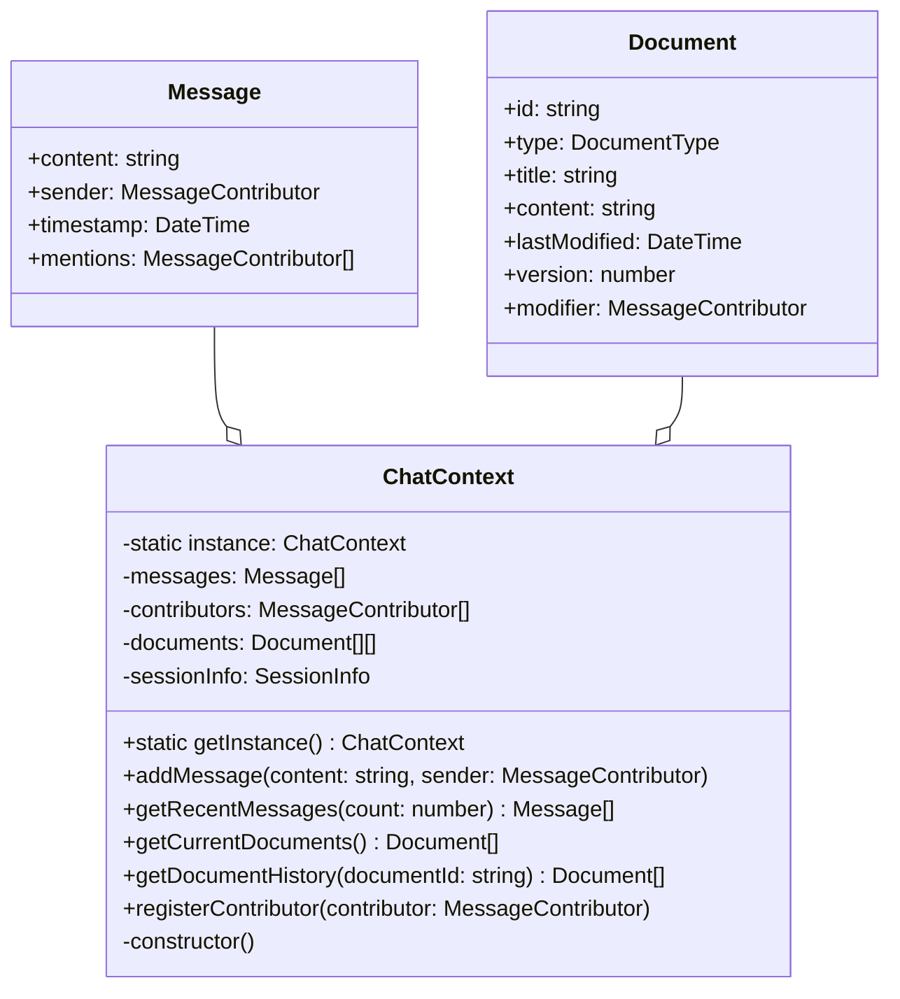

# CADDY (Collaborative AI Dialogue Dynamic System)設計書

目次
- [CADDY (Collaborative AI Dialogue Dynamic System)設計書](#caddy-collaborative-ai-dialogue-dynamic-system設計書)
  - [1. システムアーキテクチャ](#1-システムアーキテクチャ)
    - [1.1 全体構成](#11-全体構成)
      - [アーキテクチャ概要](#アーキテクチャ概要)
      - [コンポーネント構成](#コンポーネント構成)
    - [1.2 クラス設計](#12-クラス設計)
      - [ChatContext](#chatcontext)
      - [MessageContributor](#messagecontributor)
  - [2. 詳細設計](#2-詳細設計)
    - [2.1 中核クラス](#21-中核クラス)
      - [ChatContext](#chatcontext-1)
      - [MessageContributor](#messagecontributor-1)
      - [Document管理](#document管理)
    - [2.2 制御クラス](#22-制御クラス)
      - [SessionCoordinator](#sessioncoordinator)
      - [DocumentManager](#documentmanager)
  - [3. インターフェース設計](#3-インターフェース設計)
    - [3.1 外部インターフェース](#31-外部インターフェース)
      - [LLMクライアント](#llmクライアント)
      - [データベース](#データベース)
    - [3.2 内部インターフェース](#32-内部インターフェース)
      - [メッセージング](#メッセージング)
  - [4. データ設計](#4-データ設計)
    - [4.1 データモデル](#41-データモデル)
      - [エンティティ](#エンティティ)
      - [リレーション](#リレーション)
    - [4.2 永続化設計](#42-永続化設計)
      - [データベース](#データベース-1)
      - [キャッシュ](#キャッシュ)
  - [5. 処理フロー設計](#5-処理フロー設計)
    - [5.1 メッセージ処理フロー](#51-メッセージ処理フロー)
      - [基本フロー](#基本フロー)
      - [エラー処理](#エラー処理)
    - [5.2 ドキュメント処理フロー](#52-ドキュメント処理フロー)
      - [更新フロー](#更新フロー)
      - [同期処理](#同期処理)

## 1. システムアーキテクチャ

### 1.1 全体構成
#### アーキテクチャ概要
- シングルトンパターンによる状態管理
- イベント駆動型メッセージング
- マイクロサービス的な役割分担

#### コンポーネント構成
- フロントエンド（Webインターフェース）
- バックエンド（対話管理、ドキュメント管理）
- LLMサービス連携

### 1.2 クラス設計

#### ChatContext

#### MessageContributor

## 2. 詳細設計

### 2.1 中核クラス
#### ChatContext
- シングルトンインスタンス
- メッセージ履歴管理
- ドキュメント履歴管理
- セッション情報管理

#### MessageContributor
- インターフェース定義
- HumanUser実装
- AIAgent実装

#### Document管理
- バージョン管理機能
- 更新履歴追跡
- 差分管理

### 2.2 制御クラス
#### SessionCoordinator
- 対話フロー制御
- エージェント選択ロジック
- システム関数実行制御

#### DocumentManager
- ドキュメント生成ロジック
- 更新タイミング制御
- バージョン管理実装

## 3. インターフェース設計

### 3.1 外部インターフェース
#### LLMクライアント
- API仕様
- エラーハンドリング
- レスポンス形式

#### データベース
- スキーマ設計
- クエリインターフェース
- トランザクション管理

### 3.2 内部インターフェース
#### メッセージング
- イベント定義
- メッセージフォーマット
- エラー通知

## 4. データ設計

### 4.1 データモデル
#### エンティティ
- User
- Message
- Document
- Session

#### リレーション
- エンティティ間の関係定義
- 参照整合性制約
- インデックス設計

### 4.2 永続化設計
#### データベース
- テーブル構造
- インデックス
- パーティション戦略

#### キャッシュ
- キャッシュ方式
- 無効化戦略
- 整合性確保

## 5. 処理フロー設計

### 5.1 メッセージ処理フロー
#### 基本フロー
1. メッセージ受信
2. コンテキスト更新
3. エージェント選択
4. 応答生成
5. 送信処理

#### エラー処理
- タイムアウト処理
- 再試行ロジック
- エラー通知

### 5.2 ドキュメント処理フロー
#### 更新フロー
1. 更新トリガー検知
2. 差分抽出
3. バージョン作成
4. 永続化処理

#### 同期処理
- 排他制御
- 競合解決
- 整合性確保

